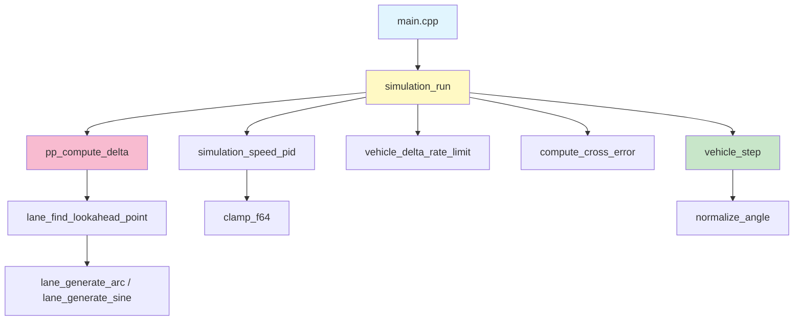

# LKS (Lane Keeping System) — 车道保持系统

| 项目 | 信息 |
|------|------|
| **作者** | Qing Xu |
| **AI 辅助工具** | Cline (基于 Qwen3.6-35B-A3B-MTP 的 AI 编程助手) |
| **AI 使用范围** | 代码重构、目录结构调整、Makefile 优化、文档编写 |

## 角色与核心开发任务

本项目是一套高性能、高安全性且易于静态分析/形式化验证的车道保持仿真代码库。

### 设计原则

1. **面向过程（Procedural C 风格）**：不使用 class，仅使用结构体和纯函数
2. **One Function Per File**：每个源文件仅包含一个函数定义
3. **SSA（静态单赋值）**：所有局部变量使用 `const` 限定并初始化后不再修改
4. **单一出口原则**：函数体中间无 return，循环内无 break/continue
5. **模块化分层**：数学库 → 车辆模型 → 车道模型 → 控制器 → 仿真引擎

---

## 目录结构

```
lks/
├── README.md                  # 项目文档 + Mermaid 图表
├── Makefile                   # 构建系统 (make / make clean / make run / make test)
├── build/                     # 编译产物目录 (.o 文件和可执行文件)
│   ├── lks                    # 可执行文件
│   ├── main.o
│   ├── math/                  # 数学库目标文件
│   │   ├── angle_normalize.o
│   │   └── clamp_f64.o
│   ├── vehicle/               # 车辆模块目标文件
│   │   ├── state_init.o
│   │   ├── params_default.o
│   │   ├── delta_rate_limit.o
│   │   └── step.o
│   ├── lane/                  # 车道模块目标文件
│   │   ├── model_init.o, model_free.o, model_push.o
│   │   ├── gen_sine.o, gen_arc.o
│   │   └── find_lookahead_idx.o, find_lookahead_pt.o
│   ├── controller/            # 控制器模块目标文件
│   │   ├── pp_config_default.o, pp_compute_delta.o, cross_error.o
│   │   └── ...
│   └── simulation/            # 仿真引擎目标文件
│       ├── speed_pid.o, run.o
│       └── ...
├── include/                   # 所有头文件（#pragma once）
│   ├── lks_config.h           # 全局配置参数
│   ├── vehicle/state.h        # 车辆状态/参数结构体 + 函数声明
│   ├── lane/model.h           # 车道模型接口
│   ├── controller/pure_pursuit.h    # 纯跟踪控制器接口
│   ├── controller/cross_error.h     # 横向误差计算接口
│   ├── simulation.h           # 仿真引擎接口
│   ├── simulation/speed_pid.h       # 速度 P 控制器接口
│   └── math/                  # 数学工具库
│       ├── angle_normalize.h
│       └── clamp_f64.h
├── src/                       # 所有源文件（One Function Per File）
│   ├── main.cpp               # main() — 唯一入口，引用 include/ 头文件
│   ├── math/                  # 共性数学库
│   │   ├── angle_normalize.cpp
│   │   └── clamp_f64.cpp
│   ├── vehicle/               # 车辆模块
│   │   ├── state_init.cpp
│   │   ├── params_default.cpp
│   │   ├── delta_rate_limit.cpp
│   │   └── step.cpp
│   ├── lane/                  # 车道模块
│   │   ├── model_init.cpp
│   │   ├── model_free.cpp
│   │   ├── model_push.cpp
│   │   ├── gen_sine.cpp
│   │   ├── gen_arc.cpp
│   │   ├── find_lookahead_idx.cpp
│   │   └── find_lookahead_pt.cpp
│   ├── controller/            # 控制器模块
│   │   ├── pp_config_default.cpp
│   │   ├── pp_compute_delta.cpp
│   │   └── cross_error.cpp
│   └── simulation/            # 仿真引擎
│       ├── speed_pid.cpp
│       └── run.cpp
├── test/                      # 测试输出目录
│   ├── trajectory.csv         # 车辆轨迹数据 (make run 生成)
│   ├── lane.csv               # 车道中心线坐标 (make run 生成)
│   ├── result.png             # 可视化结果图片 (make test 生成)
│   └── result_plot.py         # Python 轨迹可视化脚本
└── scripts/                   # 其他辅助脚本
    └── result_plot.py         # (已移至 test/)
```

---

## 函数层级关系树与公式映射

### 核心控制算法 (Pure Pursuit)

```
simulation_run()                          [仿真主循环]
├── simulation_speed_pid()                [速度 P 控制器]
│   └: a = clamp((v_target - v_current) × SPEED_P_GAIN, [-max_a, max_a])
├── pp_compute_delta()                    [纯跟踪转向角计算]
│   ├── lane_find_lookahead_point()       [前视点搜索 + 线性插值]
│   │   └: L = clamp(gain × |v|, [min_L, max_L])
│   └: delta = atan2(2 × L × sin(θ_c) / wheelbase)
├── vehicle_delta_rate_limit()            [转向速率限制]
│   └: |delta - delta_prev| ≤ delta_rate × dt
├── compute_cross_error()                 [Frenet 横向误差]
│   ├── lane_find_lookahead_index()       [最近点搜索]
│   └: cross_err = (p_vehicle - p_lane) · n_hat
└── vehicle_step()                        [自行车模型积分]
    ├── dx = v × cos(θ) × dt
    ├── dy = v × sin(θ) × dt
    └── dθ = (v / L) × tan(δ) × dt
```

### 数学公式映射表

| 函数 | 物理/数学含义 | 公式 |
|------|--------------|------|
| `simulation_speed_pid` | 速度 P 控制器 | a = K_p × (v_ref - v) |
| `pp_compute_delta` | Pure Pursuit 转向角 | δ = 2L·sin(θ_c)/L_w |
| `vehicle_delta_rate_limit` | 转向速率限制 | \|Δδ\| ≤ ṁax_δ × dt |
| `compute_cross_error` | Frenet 横向误差 | e_y = Δp · n̂ |
| `vehicle_step` | 自行车模型运动学 | x⁺ = x + v·cos(θ)·dt |

---

## 函数调用拓扑与数据流图



---

## 构建与运行

### 编译

```bash
make
# 输出: build/lks (可执行文件) + build/*.o (目标文件)
```

### 清理

```bash
make clean
# 删除 build/ 目录及所有测试输出
```

### 运行仿真

```bash
make run
# 输出: test/trajectory.csv, test/lane.csv
```

### 运行可视化

```bash
make test
# 先运行 make run，然后生成 test/result.png
```

### 输出文件

| 文件名 | 位置 | 说明 |
|--------|------|------|
| `test/trajectory.csv` | test/ | 车辆轨迹数据 (step, x, y, v, delta, cross_err) |
| `test/lane.csv` | test/ | 车道中心线坐标 (x, y) |
| `test/result.png` | test/ | 可视化结果图片 (make test 生成) |

---

## 配置参数

所有参数集中定义在 `include/lks_config.h`：

| 宏定义 | 默认值 | 说明 |
|--------|--------|------|
| `LKS_DT` | 0.05 | 控制周期 (s), 20 Hz |
| `LKS_NUM_STEPS` | 4000 | 总步数 = 200 秒仿真 |
| `LKS_TARGET_SPEED` | 15.0 | 目标速度 (m/s) = 54 km/h |
| `LKS_WHEELBASE` | 2.7 | 轴距 (m) |
| `LKS_MAX_DELTA` | π/4 | 最大转向角 = 45° |
| `LKS_DELTA_RATE_LIMIT` | 2.0 | 转向速率上限 (rad/s) |
| `PP_LOOKAHEAD_GAIN` | 0.4 | 前瞻距离增益 (s) |
| `PP_MIN_LOOKAHEAD` | 2.0 | 最小前瞻距离 (m) |
| `PP_MAX_LOOKAHEAD` | 8.0 | 最大前瞻距离 (m) |

---

## 命名规范

| 类型 | 格式 | 示例 |
|------|------|------|
| 函数/变量 | `lowerCamelCase` | `vehicle_state_init` |
| 结构体/类型名 | `UpperCamelCase` | (未使用, 仅 typedef) |
| typedef 类型名 | `lowerCamelCase_t` | `vehicle_state_t` |
| 命名空间 | 无（C 风格） | - |
| #define 宏 | `UPPERCASE_WITH_UNDERSCORES` | `LKS_WHEELBASE` |

---

## 版本历史

- **v1.0** (2026-05-29): 初始重构版本 — 从原型代码库迁移到生产级架构
  - 零警告编译通过
  - SSA 规范 + 单一出口原则
  - One Function Per File
  - `#pragma once` 头文件保护
  - 编译产物分离 (build/)
  - 测试输出分离 (test/)

---

## 备份版本

| 版本 | 路径 | 说明 |
|------|------|------|
| v1.0 (原型) | `../lks_260529_1924/` | 重构前的最终原型代码 |